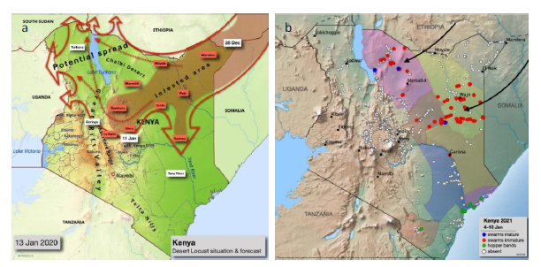

# Exploring the Potential of Remote Sensing Application to Assess Locust Damage: A Case Study of the First and Second Wave Locust Invasion in Laikipia and Samburu Counties, Kenya

## Overview

This study assessed the feasibility of using remote sensing to detect and quantify vegetation damage caused by the 2020–2021 desert locust invasions in Laikipia and Samburu counties, Kenya, using a Normalized Difference Vegetation Index (NDVI) change detection model built on Sentinel-2 Surface Reflectance imagery in Google Earth Engine (GEE). The research addresses a critical gap in locust damage assessment, where ground-based methods are limited by terrain, swarm mobility, and COVID-19 travel restrictions, offering a scalable and reproducible remote sensing alternative to support food security monitoring in Arid and Semi-Arid Lands (ASALs).

**Study Area:** Laikipia and Samburu Counties, Kenya

**Duration:** June 2021 – December 2021

**Role:** Solo project, in collaboration with researchers at the German Aerospace Center (DLR) and the United Nations University – Institute for Environment and Human Security (UNU-EHS)

**Status:** Completed

---

## Methods & Tools

**Data Sources**

- Sentinel-2 Surface Reflectance (SR) imagery — European Space Agency (ESA) via Google Earth Engine
- FAO Locust Hub — ground-based desert locust attack site data
- ESA WorldCover 2020 — Land Use and Land Cover (LULC) data at 10 m spatial resolution

**Processing Steps**

1. Ingested and pre-processed FAO Locust Hub swarm data to define invasion attack sites and buffers
2. Applied cloud masking to Sentinel-2 SR imagery in GEE to filter for cloud-free before and after invasion image collections
3. Computed before and after invasion NDVI values at each locust attack site buffer
4. Generated NDVI difference images to identify and quantify areas of vegetation decline
5. Conducted LULC-based damage assessment at county and sub-county level for cropland, forestland, and shrubland classes
6. Performed historical NDVI difference statistical analysis as a proof of concept

**Tools Used**

| Tool | Purpose |
|------|---------|
| Google Earth Engine (GEE) | Cloud-based geospatial processing and NDVI change detection |
| Sentinel-2 SR | Multispectral satellite imagery for vegetation analysis |
| Python & GEE Python API | Scripting and automation of the analysis workflow |
| QGIS | Spatial data visualization and cartographic output |
| FAO eLocust3m | Ground-based locust sighting and mapping data |

---

## Key Findings

- Samburu county suffered a total LULC damage of **196.3 ha** across cropland, forestland, and shrubland after both invasions, with Samburu East being the most adversely affected sub-county (**92.9 ha** total damage)
- Laikipia county recorded a total LULC damage of **95 ha**, with Laikipia North sub-county recording the highest loss of **34 ha** after the second wave invasion
- Laikipia recorded the highest cropland damage of **26.2 ha** across both invasions, directly exacerbating food insecurity in the county
- Results corroborated ground-based household assessments by the REACH Initiative, which reported **89% destruction of community rangelands** and **81% livestock deaths** in Samburu East
- The developed GEE model is scalable and reproducible, and can be applied to other locust-affected counties in Kenya or across East Africa

---

## Links

[View Data Source — FAO Locust Hub](https://locust.fao.org/locust-hub/){ .md-button }
[Locust-Tec Project](https://locust-tec.eoc.dlr.de/){ .md-button }
